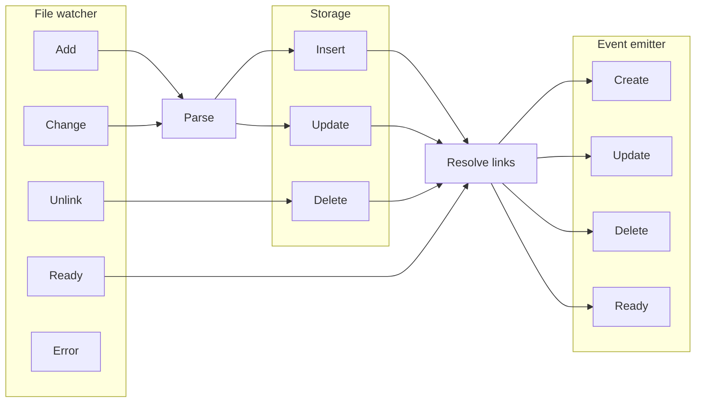

## Overview

System consists of following parts:

- **File watcher** - watches markdown files on the disk and emits events for each change
  - Currently it uses [`chokidar`](https://www.npmjs.com/package/chokidar)
  - Alternatively it can use
    - [`createFileSystemWatcher`](https://code.visualstudio.com/api/references/vscode-api#workspace.createFileSystemWatcher) in VSCode environment
    - [`tauri-plugin-fs-watch`](https://github.com/tauri-apps/tauri-plugin-fs-watch) in Tauri environment
- **Parser** - parses markdown files to extract links and frontmatter
  - Currently it uses [`remark`](https://github.com/remarkjs/remark)
  - Alternatively it can use
    - [`tree-sitter`](https://github.com/tree-sitter/tree-sitter), because it supports incremental parsing
    - [`markdown-rs`](https://github.com/wooorm/markdown-rs), because it is written in Rust
    - [others](https://stereobooster.com/posts/markdown-parsers/).
- **Storage** - used as cache to avoid reparsing files and as query engine to resolve links, to find backlinks etc.
  - Currently it uses [`sqlite`](https://www.sqlite.org/index.html) plus:
    - [`better-sqlite3`](https://www.npmjs.com/package/better-sqlite3). Alternatively it can use [`great.db`](https://www.npmjs.com/package/great.db)
    - [`Drizzle ORM`](https://orm.drizzle.team/)
  - Alternatively it can use
    - [`cozodb`](https://docs.cozodb.org), because it supports graph queries with [datalog](https://docs.cozodb.org/en/latest/tips.html)
    - [`kuzudb`](https://kuzudb.com), because it supports graph queries with [cypher](https://kuzudb.com/docusaurus/cypher/query-clauses/match)
- **Event emitter** - to pass further events after they were processed
  - Currently it uses [`mitt`](https://github.com/developit/mitt) as the simplest possible option

## Interfaces

### Implementation details

Some implementation details hidden so that it would be possible to change without affecting end users.

For example, it hides SQLite storage so that it would be possible to switch from SQLite to `cozodb`. On the other side it means that query interface needs to be implemented (`select`, `order by`, `where`, `limit` etc.) Now it is not implemented. I think to reuse query interface similar to [`facets`](https://github.com/stereobooster/facets/blob/main/packages/facets/src/Facets.ts#L138-L150).

### Events

Essentially it would be enough to expose content as graph database. But it uses file watcher and emit events. This is done so that core library could be used as LSP, or in "development mode" without the need to restart the server.

Now system emits events only for documents (nodes). I consider adding events for links (edges).

## Pathes

- `root` - root of the project.
  - Used to convert absolute pathes of files to relative path, before storing in the DB. So that DB would be protable
  - Also used as root for PML
  - Typically it would be the same folder where `.git` is stored
  - Probably would be `cwd` from where CLI runs and where `.braindb` stored
- `source` - folder relative to root
  - there can be many sources
  - for each source we can attach a schema, the same way as Astro does
  - Astro limits depth of source folder to 1, which allows to use it as "type"
- `filepath`
  - one that stored in DB and is relative to root
  - **but what about ones passed to functions?** Shall they be relative to `source`?

All pathes starts with `/` and ends with not `/`.
Web pathes starts with `/` and ends with `/`.

## Link types

Links by type of href:

- web links
  - internal, like `/something/slug`
  - external, like `https://domain/something`
- Portable markdown links (PML)
  - like `/folder/name.md`
- Wikilinks, like `[[slug]]`
  - short slug, like one word or phrase (without slashes). Example: wikipedia, Obsidian
  - long slug (path with slashes), like `folder/name`. Example: Astro, Foam

Links by type of markup:

- Markdown link `[name](href)` or `[name](<href>)`
- HTML link `<a href="href">name</a>`
- Wikilink `[[slug]]` or `[[slug|name]]`
- Reference links `[name][def]` and later `[def]: https://href`

|           | web | PML | wiki |
| --------- | --- | --- | ---- |
| markdown  | +   | +   |      |
| HTML      | +   |     |      |
| wiki      |     |     | +    |
| Reference | +   | +   |      |

## Links vs input/output

|           | Input (md) | Output (md) | Output (html) |
| --------- | ---------- | ----------- | ------------- |
| Web-link  | + (1)      | + (2)       | +             |
| PML       | + (3)      | + (4)       |               |
| Wiki-link | + (5)      |             |               |

- (1) `url` - `(filePath, frontmatter_1) => webPath`
- (2) nothing for now, unless there is a need in function which would map from one type of web pathes to another
- (3) `root` - root folder against which to resolve PML
- (4) `transformPath` - `(filePath) => filePath`
- (5) `slug` - `(filePath, frontmatter_1) => slug`
  - `Astro`: file path (without extension)
  - `Obsidian`: file name (without extension)
  - `Foam`: file name or partial file path (without extension)
  - `Hugo`: file name (without extension), also allows to set custom slug in frontmatter
- (6) `transformFrontmatter` - `(filePath, frontmatter_1) => frontmatter_2`
  - conversion happens as the last step before generating markdown, so "generated" fields not stored in the DB
  - can be used, for example, to store backlinks in frontmatter
  - or any other generated fields, such as `title` (when converted from Obsidian), `url` or `slug`

## Schema (for frontmatter)

It is open question about how to map a schema to files. One of options is to use one schema per folder:

- the same way as Astro does
- one can thought of it as database tables - each folder in the root is a table (page type)

If schemas do not have same fields or same-named fields have the same type - it would be possible to merge all schemas into one for faceted search (missing fields would become nullable).

There can be one schema per root folder (to make things easier).

Absence of a schema can be treated as:

- pass everything as is
- pass nothing

## DB

### Document

- `id` - number (autoincrement) for simplicity
- `path` - string, alternative key (unique)
- `frontmatter` - JSON-column, optionally can be validated with a schema
  - `title` - can be generated from slug or file name (TODO: make it optional, but it required for wikilinks)
- `content` - either string or parse tree (as JSON)
- `slug` - string, generated from the path or taken from frontmatter. Not unique at DB level, but will warn
- `url` - string, generated from slug, path and maybe type
- `type` - string, optional. Can be used to match different Schemas

### Link

- `from` - string. "foreign key" - `document.path`
- `position` - number. `from + position` - unique
- `to` - string, null. "foreign key" - `document.path`
- `to_path` - string, null.
- `to_slug` - string, null.
- `to_url` - string, null.
- `to_anchor` - string, null.
- `metadata` - maybe text of the link, maybe parsed fragment

`to` - initally null. `to_path`, `to_slug`, `to_url` - are extracted from markup of the link and only used to match document, correspondingly `link.to_path = document.path`, `link.to_slug = document.slug`, `link.to_url` = `document.url`. If document found - `to` field updated with `path`.
