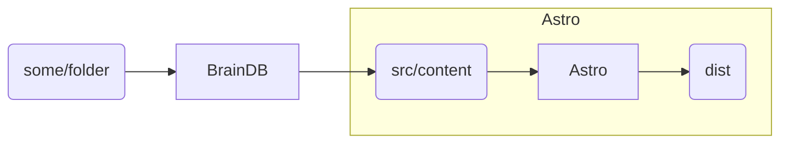
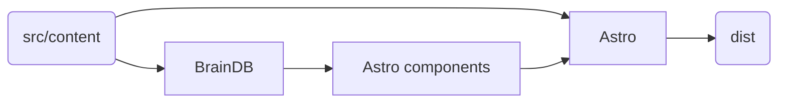
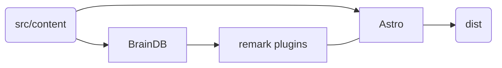

> [!WARNING]
> This is outdated article.

## Options

### Option 1: (`@braindb/cli`)

In this case `BrainDB` acts as [obsidian-export](https://nick.groenen.me/projects/obsidian-export/).

### Option 2: augment though Astro components

In this case `Astro` is repsonsible for rendering and `BrainDB` used to add features on top, for example, backlinks. Basically BrainDB and Astro Content Collections run in parallel and fully independent.

### Option 3: augment though Remark plugins

In this case `Astro` is repsonsible for rendering and `BrainDB` hooked in through remark plugins. BrainDB in this case responsible, for example, for wikilinks, datview.

## Old links

Ideas from discussions:

- https://github.com/withastro/roadmap/discussions/424
- https://github.com/withastro/roadmap/discussions/688
- https://github.com/withastro/roadmap/discussions/769
- https://github.com/withastro/roadmap/discussions/434
- https://github.com/withastro/roadmap/discussions/759
- https://github.com/withastro/roadmap/discussions/736
- https://github.com/withastro/roadmap/discussions/739
- https://github.com/withastro/roadmap/discussions/704
- https://github.com/withastro/roadmap/discussions/696
- https://github.com/withastro/roadmap/discussions/686
- https://github.com/withastro/roadmap/discussions/687
- https://github.com/withastro/roadmap/discussions/551
- https://github.com/withastro/roadmap/discussions/423
- https://github.com/withastro/roadmap/discussions/505
- https://github.com/withastro/roadmap/discussions/487
- https://github.com/withastro/roadmap/discussions/470
- https://github.com/withastro/roadmap/discussions/457
- https://github.com/withastro/roadmap/discussions/334
- https://github.com/withastro/roadmap/discussions/76

## TODO

- Vite/Astro plugin which would provide
  - [Virtual Module](https://vitejs.dev/guide/api-plugin#virtual-modules-convention) with braindb instance configured with [sensible defaults](https://astro-digital-garden.stereobooster.com/recipes/braindb/)
  - configure other defaults for Astro as `optimizeDeps.exclude`
- [remark plugin for wikilinks](https://astro-digital-garden.stereobooster.com/recipes/wikilinks/)
  - handle anchors
  - handle image wikilinks
