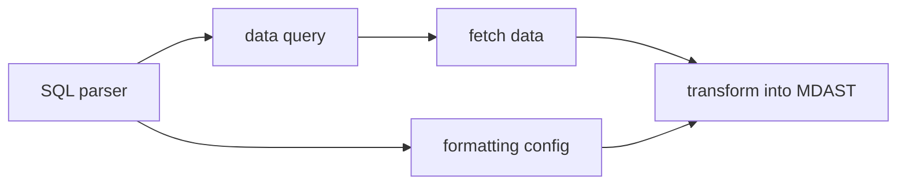

## Idea

### Concept

Project inspired by Obsidian DataView, but there are some differences.

First of all I decided to use real SQL instead of custom dialect used by DataView.

**Pros**:

- it is easy to learn, because there is huge community and a lot of documentation
- it is easy to implement, because project already uses relational database (SQLite)

**Cons**:

- it exposes data structure, so every time model changed it will break downstream projects
- it locks-in project to use relational database. I had idea to try graph database

Having real SQL would allow to show data at least as table (all SQL clients output result as tables, even if there is only one cell). Other templates can be, for example:

- list, if there is only one column
- nested list
- etc.

Template be customized through meta string ("fence meta"):

````md
```dataview <template> <other options>
  SELECT a, b, c FROM nodes;
```
````

Plus I can add custom function which can format output, for example:

- `dv_link(text, url)` would output markdown link `[text](url)`

### Implementation

This will be remark plugin. It will find all code blocks ("fence blocks") with language "dataview", will take content as query, execute query using BrainDB, transform result to MDAST and replace given code block. So result can be post-processed by other remark/rehype plugins.

In order to implement custom functions, I would use SQL parser which will remove custom function from SQL before it is executed. But those functions would be used to format resulting data before transforming it into MDAST.



That's it.

### Future

#### Extension

As an improvement one can implement VSCode extension which would highlight syntax and propose autocompletition. I think this should be possible with [langium-sql](https://github.com/TypeFox/langium-sql/blob/main/packages/langium-sql/).

Related:

[VSCode Markdown Fenced Code Block Grammar Injection Example](https://github.com/mjbvz/vscode-fenced-code-block-grammar-injection-example)

#### Improved tables

Maybe table template can be combined with [sortable tables](https://astro-digital-garden.stereobooster.com/recipes/sortable-tables/)?

#### Graph template

For example, select data from links table. Convert it to dot format. Output as code block, which would be consequently processed by `@beoe/rehype-graphviz`.

Or for example, one can use `@beoe/rehype-gnuplot` to produce plots based on data.

This is **another bonus** of this architecture - it is modular and can be combined with other solutions.

### SQL parser

- https://github.com/taozhi8833998/node-sql-parser
  - dialect: a lot, parser: pegjs, typescript
- https://github.com/JavaScriptor/js-sql-parser
  - dialect: MySQL, parser: jison
- https://alasql.org/
  - dialect: ?, parser: jison
- https://github.com/launchql/pgsql-parser
  - dialect: PostgreSQL, parser: ?
- https://github.com/TypeFox/langium-sql/blob/main/packages/langium-sql/
  - no idea how to use it as simple parser
- https://nanosql.io/welcome.html
- https://github.com/kristianmandrup/chevrotain-mini-sql-lang
  - https://chevrotain.io/docs/tutorial/step3b_adding_actions_embedded.html#sql-grammar
  - https://www.npmjs.com/package/rhombic
  - last commit 5 years ago
- https://github.com/forward/sql-parser
  - last commit 9 years ago
- https://github.com/DerekStride/tree-sitter-sql
  - https://github.com/lezer-parser/import-tree-sitter

## Examples

#### [Alphabetical index](https://astro-digital-garden.stereobooster.com/alphabetical/):

```dataview list
SELECT upper(substr(frontmatter ->> '$.title', 1, 1)) as letter, dv_link(url, frontmatter ->> '$.title') as link
FROM documents
ORDER BY frontmatter ->> '$.title'
LIMIT 2;
```

#### [Recently changed](https://astro-digital-garden.stereobooster.com/recent/)

```dataview list
SELECT date(updated_at / 1000, 'unixepoch') as date, dv_link(url, frontmatter ->> '$.title') as link
FROM documents
ORDER BY updated_at DESC
LIMIT 2;
```

#### [Task list](https://astro-digital-garden.stereobooster.com/recipes/task-extraction/)

```dataview list
SELECT dv_link(url, frontmatter ->> '$.title') as link, dv_ast(tasks.ast) as "description"
FROM tasks JOIN documents ON documents.path = tasks.from
ORDER BY updated_at, path DESC
LIMIT 2;
```

#### Other

- simplest views are
  - [x] table (any number of columns)
    - [ ] align columns based on type (string left, numbers right)
  - [x] list
    - [ ] need to pass css class
    - [ ] `dv_list_item` checked,
  - [ ] nested-list (any number of columns)
- view comes from meta string
  - https://github.com/Microflash/fenceparser
  - https://github.com/frencojobs/fenceparser
- need to handle `*`
- to confirm it works implement
  - [Tags page](https://astro-digital-garden.stereobooster.com/tags/)
  - Backlinks?
    - I would need special function which would return value of current page
- [ ] change fields from `some.thing` to `frontmatter ->> '$.some.thing'`, except built-in fields
  - this won't work for dates (and arrays?)
    - would need type-cast function or schema ([[frontmatter-schema]])
- does it need graph-query language syntax? See [Graph query language](https://graph.stereobooster.com/notes/Graph-query-language)
  - example https://playground.memgraph.com/
