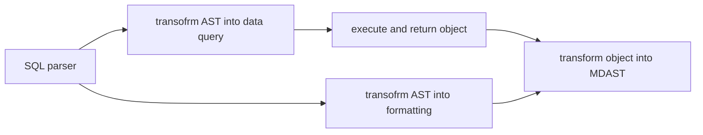

- take SQL as is
  - as the simplest option I can expose raw SQL, which would expose tables structure
    - [mddb table structure for comaprison](https://github.com/datopian/markdowndb/blob/main/src/lib/schema.ts): files, tags, file_tags, links, tasks
  - on the other hand I would get all SQLite functions "for free"
- data formatting comes from meta string
  ````md
  ```dataview table
    SELECT a, b, c FROM nodes;
  ```
  ````
- formatting can be customized from plugin or from meta string

  ````md
  ```dataview table {css=something}

  ```
  ````

- simplest views are table, list, list of lists
- `link` - sql function that does nothing for data, but create a link in the output
  - to be explicit it can take arguments `link(url, title)`, which will be transformed to data query `url, title`
- need SQL parser anyway
  - to process `link`
  - to change fields from `some.thing` to `frontmatter ->> '$.some.thing'`
    - this won't work for dates (and arrays?)
      - would need type-cast function or schema

---

## Old



### Thoughts

- SQL-like language can be alternative to [[content-query]]
  - _content query_ can be typesafe and more natural (DSL)
  - but there are a lot of open questions for _content query_, where is _SQL-like language_ can express anything
- remark-dataview can be alternative to
  - "alphabetical index" page
  - "latest changed" page
  - "extract all tasks" page
  - "graphview" page
  - and many more
- Syntax
  - `SELECT` may correspond to table view
  - fields are all fields from frontmatter and some special fields
    - `lastUpdated` can come from `git` if not present in frontmatter
    - `slug` can be autogenerated if not present in frontmatter
    - `url` can be autogenerated if not present in frontmatter
    - `link` special field to generate link to the page (`<a href="[url]">[title]</a>`)
      - or maybe a function, so I can create links for different objects (pages, tags)
  - `LIST` can be alternative to `SELECT` to use list representation instead of table
  - how to "group by" for example for alphbetical list
    - `GROUP BY` can use the same semantics as SQL
    - `CLUSTER BY` can be used to return groups
      - for example, `LIST .... CLUSTER BY` would return list of lists
  - `FROM` - optional. Can use
    - path `FROM a/b/c`
    - glob pattern `FROM */**.md`
    - tags `FROM #a`
    - `FROM` doesn't make sense in this context. It could be as well replaced by Where
      - `WHERE path LIKE a/b/c`, `WHERE tag = "a"`
  - `GRAPH` can be alternative to `SELECT` to use network representation
    - can return code block with graphviz or mermaid to MDAST (which later can be compiled to actual graph)
      - won't work for really big graphs
    - does it need graph-query language syntax to work? See [Graph query language](https://graph.stereobooster.com/notes/Graph-query-language)
      - example https://playground.memgraph.com/
    - in order to generate graph I need at least `start`, `finish` e.g. each row is an edge in the graph
      - it can contain additional properties, like label or color
      - if one of point is `NULL` it means this is node without edge
  - `PLOT` can be alternative to `SELECT` to use diagram representation
    - `PLOT XYChart(column_x, column_y) FROM ... GROUP BY ...`
  - a lot of SQL functions, like `max`, `concat`
    - can implement incremantally all unsuported functions would throw an exception
  - Do I even need custom keywords, like `LIST`, `GRAPH`, `PLOT`?
    - Maybe use functions instead
    - Maybe use keyword after `SELECT`, similar to `FLATTENED`, `DISTINCT`, `TOP`?
    - Those modifiers make sense only for markdown / html representation. For data queries it doesn't make much difference
      - So if I would expose SQL for programatic use (intead of _content query_), they would be ignored in that context
      - For example, `SELECT LIST link` would correspond to data query `SELECT url, title`. And later markdown output would be turned in a list of links
- Without schema "dynamic" or predefined ([[frontmatter-schema]]) there would be no limit to which columns select
  - non-existent columns would be accepted, but always would return `NULL`
  - I can "collect" schema while parsing files
    - there can be problems with string vs date, integer vs flaot etc.

#### Plan

- take Langium SQL parser
  - because it would be possible to modify grammar
  - because it has typescript signatures for AST
  - expose parser, because I would need it for remark-dataview
- start with the simplest option
  - `SELECT column FROM "doesn't matter"`
    - change SQL to omit `FROM` (or make it optional)
      - or simply ignore `FROM`, to be compatible with standard SQL
    - first support only built-in fields (make a list)
    - what about `frontmatter` fields, shall I use columns names like `fm.something` or `frontmatter.something`, to avoid confusion with built-in fields?
      - but what about fields that user can override in frontmatter?
      - shall I use bare identifiers which can mean frontmatter (if it is present) and built-in otherwise?
        - plus `fm.something` to select exactly from frontmatter
        - and `bi.something` to select exactly from built-in
      - what about fields with dots in frontmatter?
        - I can use quotes so `"a.b"` is not the same as `a.b` (which is rather `"a"."b"`)
      - what about array values? Classical SQL doesn't have array values so it's easier there
        - `x = "a"`. Easy if `x` is scalar, so it straight comparison
          - but what if it is an array
            - is it `"a" in X`?
            - is it `X = ["a"]`
          - also it will be compiled to different SQL queries depending on type
            - ` EXISTS (SELECT 1 FROM json_each(tags) WHERE value = 'love')` or `tags LIKE '%"love"%'`
            - https://www.sqlite.org/json1.html
  - add support for `SORT BY`
  - add support for `WHERE`
    - `=`, `!=`, `>`, `<`, `IN`, `LIKE`
  - ...

### SQL parser

- https://github.com/TypeFox/langium-sql/blob/main/packages/langium-sql/src/sql.langium
- https://github.com/kristianmandrup/chevrotain-mini-sql-lang
  - https://chevrotain.io/docs/tutorial/step3b_adding_actions_embedded.html#sql-grammar
- https://nanosql.io/welcome.html
- https://github.com/JavaScriptor/js-sql-parser
- https://github.com/forward/sql-parser
- https://alasql.org/
- https://github.com/taozhi8833998/node-sql-parser

### Remark plugin

- [ ] remark-dataview
  - there is PoC, need to extend with [full DQL parser](https://github.com/blacksmithgu/obsidian-dataview/blob/master/src/query/parse.ts)

### Other

- [obsidian-dataview](https://github.com/blacksmithgu/obsidian-dataview):
  - can I fork [it](https://github.com/blacksmithgu/obsidian-dataview/blob/master/src/index.ts) and replace obsidian vault with braindb?
