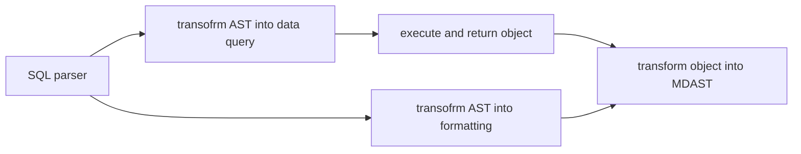

#### [Alphabetical index](https://astro-digital-garden.stereobooster.com/alphabetical/):

- [ ] need to show as list
- [ ] need to pass css class

```dataview list
SELECT upper(substr(frontmatter ->> '$.title', 1, 1)) as letter, dv_link(frontmatter ->> '$.title', url) as link
FROM documents
ORDER BY frontmatter ->> '$.title'
LIMIT 2;
```

#### [Recently changed](https://astro-digital-garden.stereobooster.com/recent/)

```dataview list
SELECT date(updated_at / 1000, 'unixepoch'), dv_link(frontmatter ->> '$.title', url) as link
FROM documents
ORDER BY updated_at DESC
LIMIT 2;
```

#### [Task list](https://astro-digital-garden.stereobooster.com/recipes/task-extraction/)

- [ ] `dv_list_item`

```dataview list
SELECT dv_link(frontmatter ->> '$.title', url) as link, checked, dv_ast(tasks.ast) as "description" 
FROM tasks JOIN documents ON documents.path = tasks.from
ORDER BY updated_at, path DESC
LIMIT 2;
```

- [x] take SQL as is
  - as the simplest option I can expose raw SQL, which would expose tables structure
  - on the other hand I would get all SQLite functions "for free"
- [x] need SQL parser anyway
  - [x] to process `link`
  - [ ] to change fields from `some.thing` to `frontmatter ->> '$.some.thing'`
    - this won't work for dates (and arrays?)
      - would need type-cast function or schema
- data formatting comes from meta string
  ````md
  ```dataview table
    SELECT a, b, c FROM nodes;
  ```
  ````
- formatting can be customized from plugin or from meta string

  ````md
  ```dataview table {css=something}

  ```
  ````

- simplest views are table, list, list of lists
- to confirm it works implement
  - [Tags page](https://astro-digital-garden.stereobooster.com/tags/)
  - Backlinks?
  - Content graph?

---

## Old



### Thoughts

- Without schema "dynamic" or predefined ([[frontmatter-schema]]) there would be no limit to which columns select
  - non-existent columns would be accepted, but always would return `NULL`
  - I can "collect" schema while parsing files
    - there can be problems with string vs date, integer vs flaot etc.
- does it need graph-query language syntax to work? See [Graph query language](https://graph.stereobooster.com/notes/Graph-query-language)
  - example https://playground.memgraph.com/
  
### SQL parser

- https://github.com/taozhi8833998/node-sql-parser
  - dialect: a lot, parser: pegjs, typescript
- https://github.com/JavaScriptor/js-sql-parser
  - dialect: MySQL, parser: jison
- https://alasql.org/
  - dialect: ?, parser: jison
- https://github.com/launchql/pgsql-parser
  - dialect: PostgreSQL, parser: ?
- https://github.com/TypeFox/langium-sql/blob/main/packages/langium-sql/
  - no idea how to use it as simple parser
- https://nanosql.io/welcome.html
- https://github.com/kristianmandrup/chevrotain-mini-sql-lang
  - https://chevrotain.io/docs/tutorial/step3b_adding_actions_embedded.html#sql-grammar
  - https://www.npmjs.com/package/rhombic
  - last commit 5 years ago
- https://github.com/forward/sql-parser
  - last commit 9 years ago
- https://github.com/DerekStride/tree-sitter-sql
  - https://github.com/lezer-parser/import-tree-sitter
