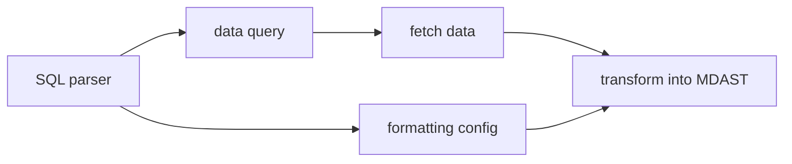

# @braindb/remark-dataview

> [!WARNING]
> Work in progress. Expect breaking changes.

## Idea

### Concept

The project is inspired by Obsidian DataView, but there are some differences.

First, I decided to use real SQL instead of the custom dialect used by DataView.

**Pros**:

- It is easy to learn due to the large community and extensive documentation.
- It is easy to implement since the project already uses a relational database (SQLite).

**Cons**:

- It exposes the data structure, so any changes to the model will break downstream projects.
- It locks the project into using a relational database, though I had considered experimenting with a graph database.

Real SQL would at least allow the data to be displayed as a table (since all SQL clients output results in tables, even if there's only one cell). Other templates could include:

- A list, if there's only one column.
- A nested list.
- Etc.

The template can be customized through a meta string (the "fence meta"):

````md
```dataview <template> <other options>
  SELECT a, b, c FROM nodes;
```
````

Additionally, I can add a custom function to format output. For example, `dv_link(text, url)` would output a Markdown link: `[text](url)`.

### Implementation

Remark plugin will find all code blocks (or "fence blocks") with the language "dataview," treat the content as a query, execute the query using BrainDB, transform the result into MDAST, and replace the original code block. This way, the result can be post-processed by other Remark/Rehype plugins.

To implement custom functions, I would use an SQL parser to remove custom functions from the SQL before executing it. These functions would then be used to format the resulting data before transforming it into MDAST.



That's it.

### Future

#### Extension

As an improvement, a VSCode extension could be implemented to highlight syntax and provide autocompletion. I believe this should be possible with [langium-sql](https://github.com/TypeFox/langium-sql/blob/main/packages/langium-sql/).

Related: [VSCode Markdown Fenced Code Block Grammar Injection Example](https://github.com/mjbvz/vscode-fenced-code-block-grammar-injection-example)

#### Improved Tables

Perhaps the table template could be combined with [sortable tables](https://astro-digital-garden.stereobooster.com/recipes/sortable-tables/)?

#### Graph Template

For example, one could select data from the links table, convert it to DOT format, and output it as a code block, which would then be processed by `@beoe/rehype-graphviz`.

Alternatively, one could use `@beoe/rehype-gnuplot` to generate plots based on the data.

This is **another bonus** of this architecture — it is modular and can be integrated with other solutions.

#### ✅ [Alphabetical index](https://astro-digital-garden.stereobooster.com/alphabetical/)

````md
```dataview list root_class=column-list
SELECT upper(substr(frontmatter ->> '$.title', 1, 1)), dv_link()
FROM documents
WHERE frontmatter ->> '$.draft' IS NULL OR frontmatter ->> '$.draft' = false
ORDER BY frontmatter ->> '$.title'
LIMIT 2;
```
````

#### ✅ [Recently changed](https://astro-digital-garden.stereobooster.com/recent/)

````md
```dataview list root_class=column-list
SELECT date(updated_at / 1000, 'unixepoch'), dv_link()
FROM documents
WHERE frontmatter ->> '$.draft' IS NULL OR frontmatter ->> '$.draft' = false
ORDER BY updated_at DESC
LIMIT 2;
```
````

#### ✅ [Task list](https://astro-digital-garden.stereobooster.com/recipes/task-extraction/)

````md
```dataview list
SELECT dv_link(), dv_task()
FROM tasks JOIN documents ON documents.path = tasks.from
WHERE frontmatter ->> '$.draft' IS NULL OR frontmatter ->> '$.draft' = false
ORDER BY updated_at DESC, path, tasks.start
LIMIT 2;
```
````

#### ✅ [Tags list](https://astro-digital-garden.stereobooster.com/tags/)

````md
```dataview list root_class=column-list
SELECT tags.value as tag, dv_link()
FROM documents, json_each(frontmatter, '$.tags') tags
WHERE frontmatter ->> '$.draft' IS NULL OR frontmatter ->> '$.draft' = false
ORDER BY tag
LIMIT 2;
```
````
